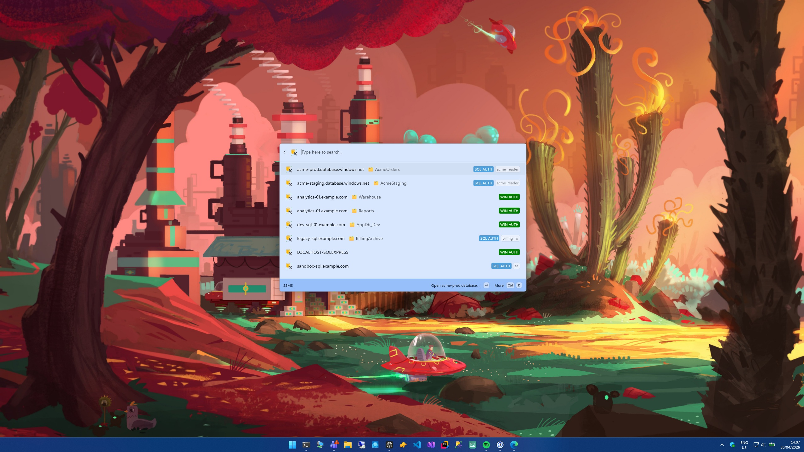

# SSMS Command Palette

A PowerToys Command Palette extension that surfaces your SQL Server
Management Studio connections so you can launch them directly from CmdPal.



## Features

- Browse all SSMS connections from your local `UserSettings.xml`
- Auth tags (Windows Auth / SQL Server Auth) and username for SQL auth
- Database name surfaced as the subtitle when set
- Open a connection directly in SSMS by selecting it
- Auto-detects the most recently used SSMS version (18 / 19 / 20 / 21) — no
  extra config

## How it works

The extension reads `UserSettings.xml` from
`%APPDATA%\Microsoft\SQL Server Management Studio\<version>\`. If multiple
SSMS versions are installed it picks whichever `UserSettings.xml` was
written most recently. Each `<ServerConnectionSettings>` block becomes a
Command Palette item; selecting one launches `Ssms.exe` with `-S <server>`
(plus `-d <database>` and `-U <user>` when those are set).

## Requirements

- **Windows 10 2004+** or **Windows 11**
- **SQL Server Management Studio 18, 19, 20, or 21** installed in the
  default Program Files location
- Microsoft PowerToys with **Command Palette** support

## Installation

Not yet published to the Microsoft Store or WinGet — install by building
from source. See [docs/development.md](docs/development.md).

## Usage

After installation, open **PowerToys Command Palette** and look for the
**SSMS** provider. Type to search across your servers / databases /
usernames, then press <kbd>Enter</kbd> to open the selected connection in
SSMS.

## Development

See [docs/development.md](docs/development.md) for local build, signing,
install/uninstall, and demo-mode instructions.

## Releasing

See [docs/releasing.md](docs/releasing.md). No GitHub Actions release
pipeline is set up yet for this repo — once added it will mirror the
sibling workflows.

## Project structure

```text
SSMSCommandPalette/
├─ Commands/      # Command Palette invokable commands
├─ Models/        # SSMS connection model and query result
├─ Pages/         # Command Palette list pages
├─ Services/      # UserSettings.xml parsing and Ssms.exe discovery
├─ Assets/        # App and extension icons
└─ build-msix.ps1 # Signed MSIX build script
```

## Troubleshooting

### The extension shows "SSMS not found"

The extension looks for `Ssms.exe` in the standard install locations under
`C:\Program Files` and `C:\Program Files (x86)` for SSMS 18 / 19 / 20 / 21.
If you've installed SSMS to a non-default location, this extension won't
find it.

### The extension shows "SSMS UserSettings.xml not found"

Open SSMS at least once and connect to a server so it writes a
`UserSettings.xml` under
`%APPDATA%\Microsoft\SQL Server Management Studio\<version>\`.

### Selecting a connection does nothing

The extension launches `Ssms.exe -S <server> [-d <database>] [-U <user>]`.
For SQL Server Auth, SSMS prompts for the password — it isn't read from
`UserSettings.xml`. If SSMS doesn't open, confirm the executable runs
manually:

```powershell
& "C:\Program Files (x86)\Microsoft SQL Server Management Studio 20\Common7\IDE\Ssms.exe" -S "your-server"
```

## Acknowledgements

The connection-loading logic is ported from the
[Raycast SSMS extension](https://github.com/raycast/extensions/tree/main/extensions/ssms)
by [hjord](https://github.com/hjord).

## License

This project is licensed under the [MIT License](LICENSE).

## Disclaimer

This project is an independent extension for Microsoft PowerToys and is
not affiliated with or endorsed by Microsoft.
